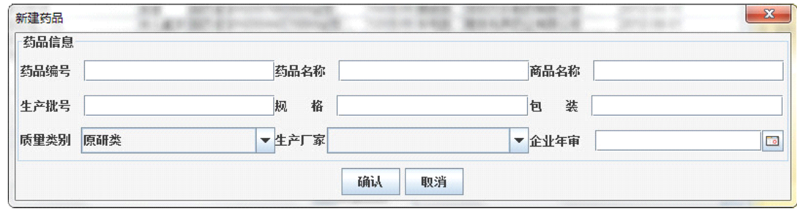
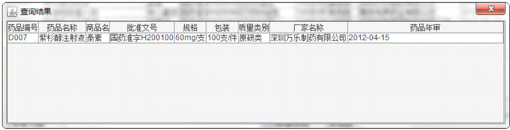
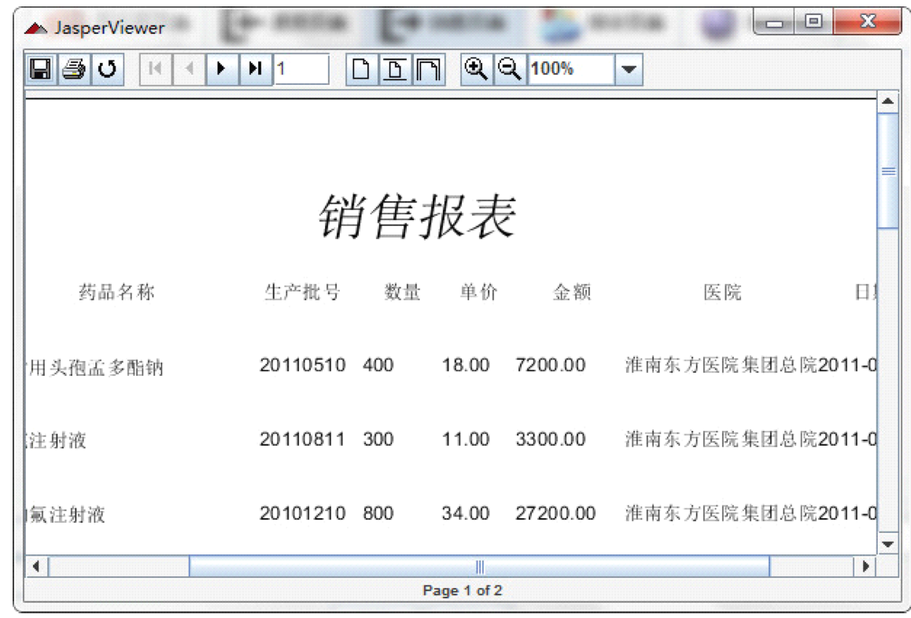
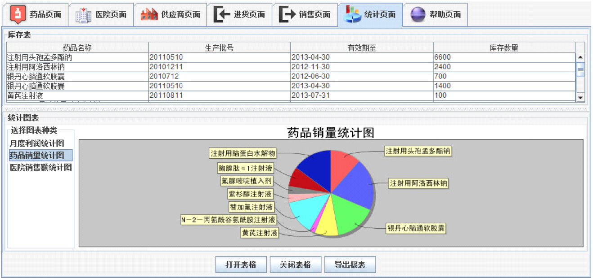
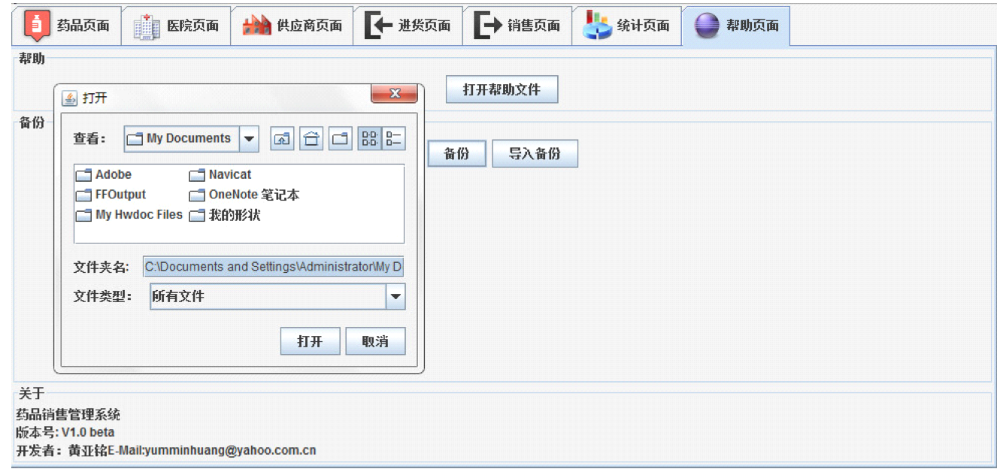

DrugSaleAdministration README
=============================
##简介
暨南大学计算机系2009级数据库课程设计——药品销售管理系统
##工具

* Database: Microsoft Office Access
* Language: Java 1.6
* GUI: Java AWT
* Report Generator: JasperReport

##截图

#### 软件首页

#### 新建记录

#### 查询记录

#### 生成报表

#### 统计

#### 数据备份

